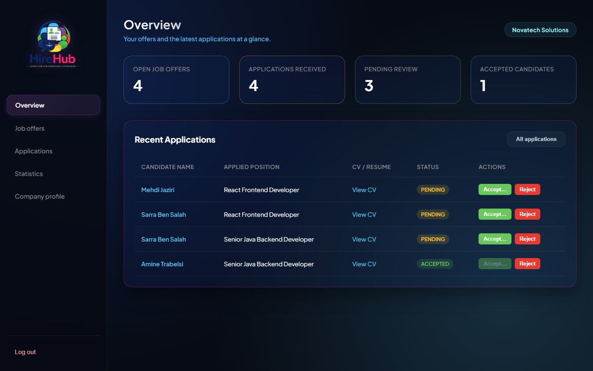
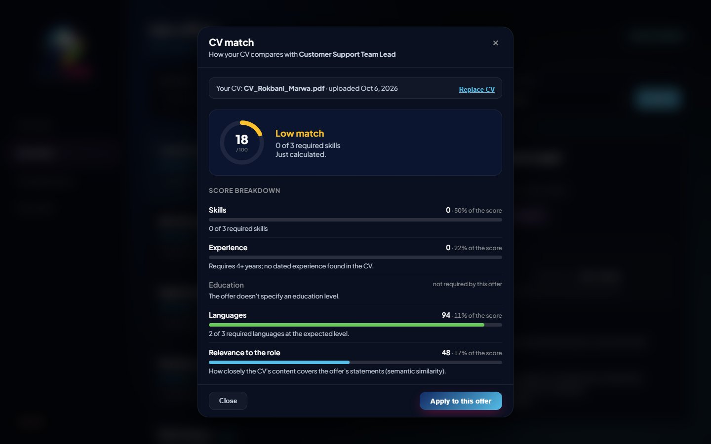
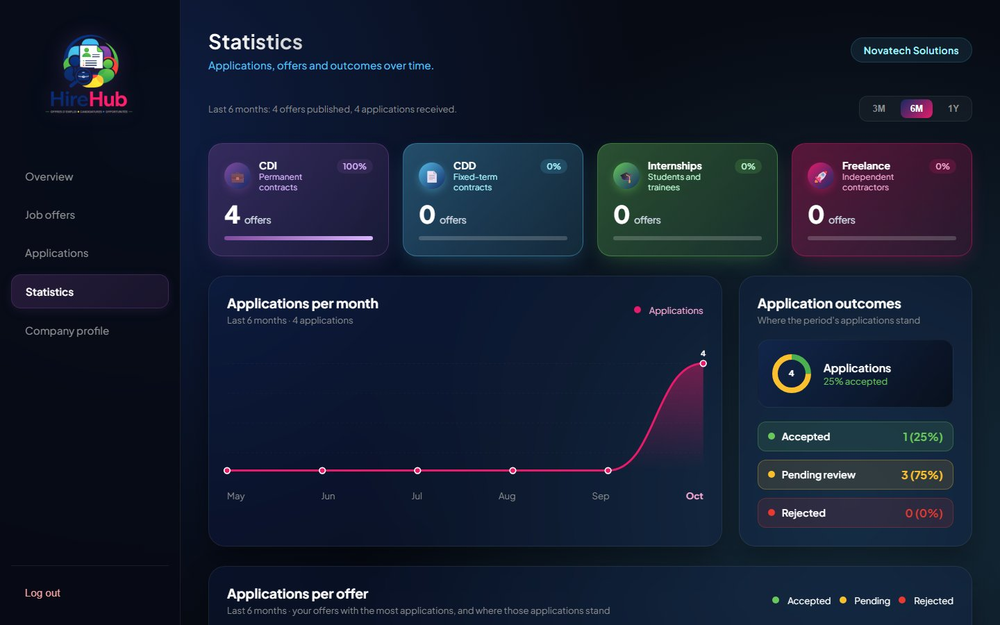
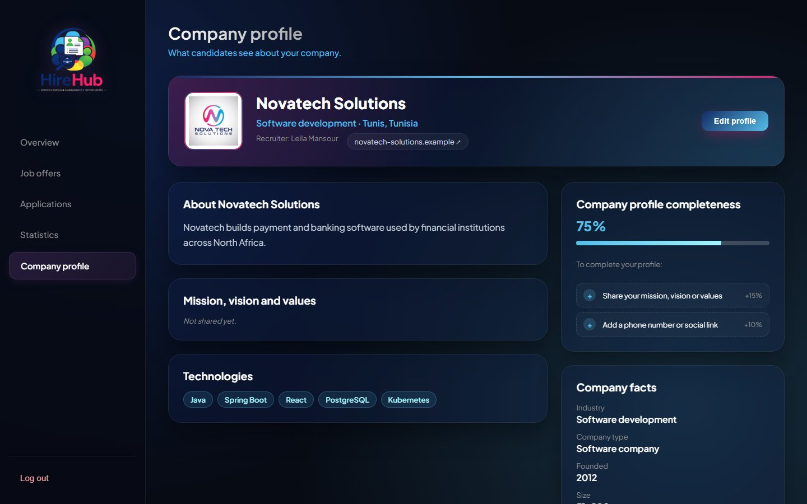
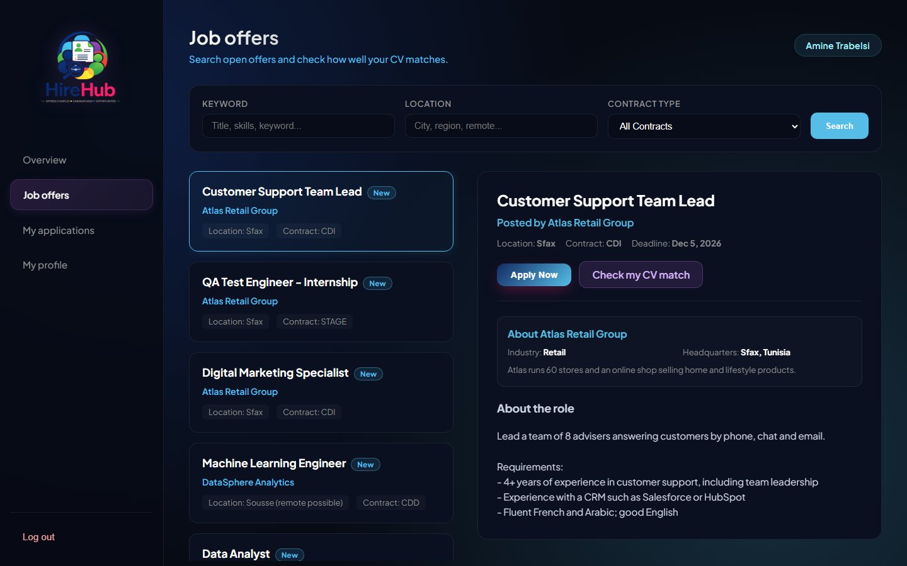
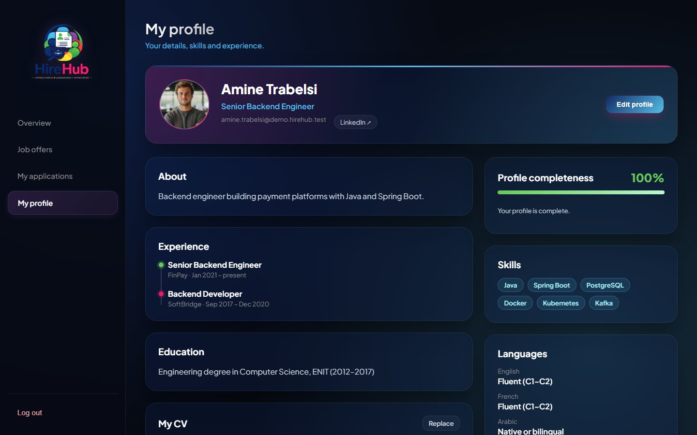
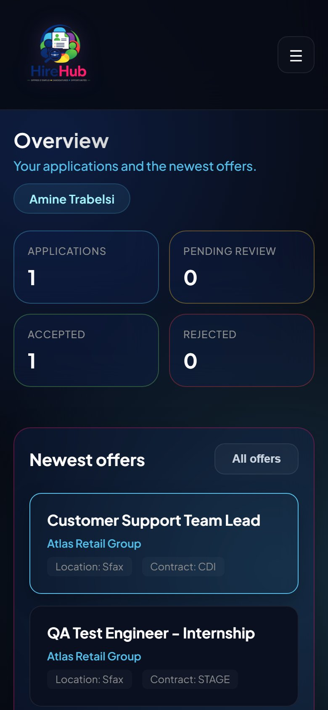
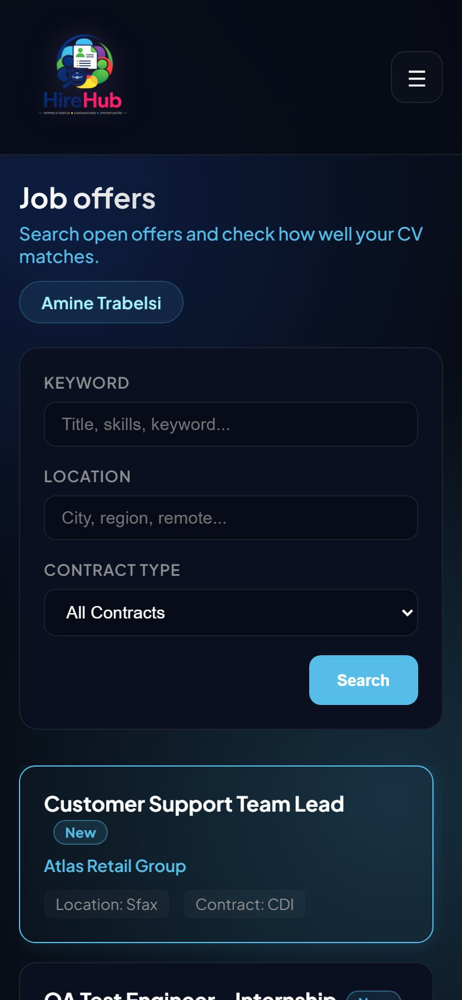
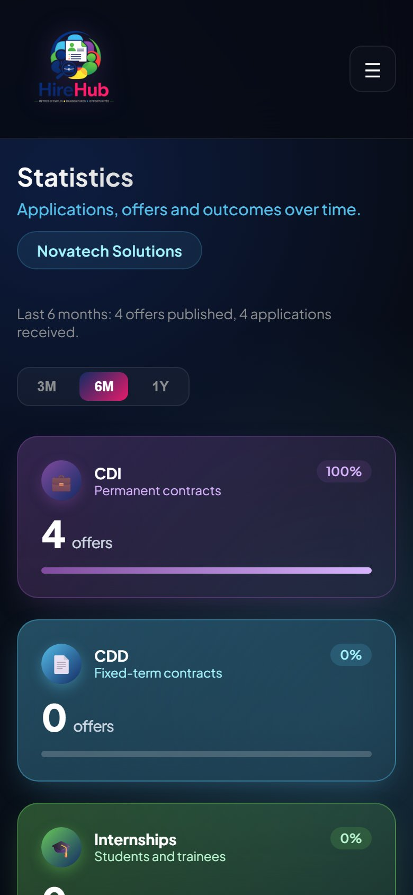
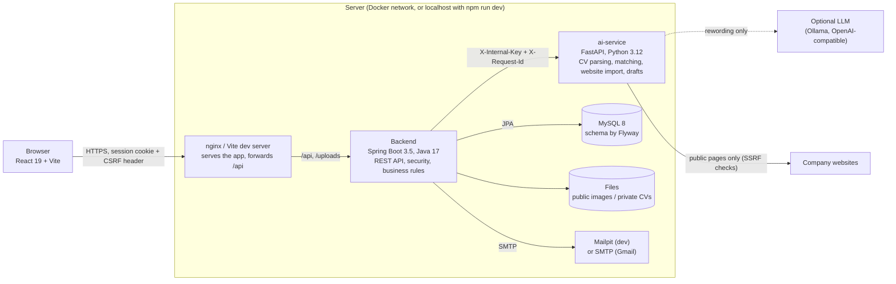

# HireHub

[](https://github.com/medguirat/HireHub/actions/workflows/ci.yml)

Recruitment platform with two roles: **recruiters** publish offers and follow applications, **candidates** find
offers, see how well their CV matches each one, and apply. CV matching is explainable (every point of the score
comes from the CV and the offer), and the AI only ever works from what the user entered.

## Features

**Candidates**
- Search open offers (keyword, location, contract type); newest first.
- **CV match** for any offer: a 0–100 score with a breakdown (skills, experience, education, languages, relevance)
  and concrete advice, in French or English. No made-up score: if the matching service is down, the page says so.
- Apply with the stored CV (or another PDF) and a cover letter; follow each application and interview invitation.
- Profile with photo, headline, experience, skills, languages, links, a completeness checklist and a "Draft my
  bio" helper that only uses the profile's own data.

**Recruiters**
- Publish, edit, **close** (keeps the applicants) or delete offers.
- See applications with the candidate's CV in the page, accept with an interview date and type (on site / remote),
  reject, and evaluate candidates (four criteria rated 1–5, three checks, notes, a score out of 20).
- Statistics computed from real data (offers, applications, outcomes per period and per offer).
- Company profile **imported from the company website** at signup (schema.org, meta tags, Mission / Vision /
  Values sections), with SSRF protection; imported fields are marked until reviewed.

**Platform**
- Signup signs in straight away; welcome and "forgot password" emails (HTML + text) through Gmail or Mailpit.
- HttpOnly cookie session with CSRF protection, rate limits on login and password reset, private CVs.
- One error format everywhere, with a request id that leads to the server's log lines.
- Fixed navigation, responsive down to 390 px, labelled form fields and dialogs.
- Docker images and compose stack, CI on every pull request, Flyway migrations, Swagger UI, health probes.

## Screenshots

| | |
|---|---|
|  |  |
| Recruiter overview | A candidate's CV match for an offer |
|  |  |
| Statistics from real data | Company profile, imported from the website |
|  |  |
| Offer search | Candidate profile with completeness |

<p align="center">
  
  
  
</p>

All screenshots are in [`docs/screenshots`](docs/screenshots); `npm run screenshots` takes them again from the demo
data (with the stack running and `npm run seed` done).

## Architecture



| Part | Stack | Port (dev) | Role |
|---|---|---|---|
| `frontend/` | React 19, Vite, axios | 5173 | The single-page app; same origin as the API (Vite proxy in dev, nginx in Docker) |
| `backend/` | Spring Boot 3.5, Spring Security, JPA/Hibernate, Flyway, MySQL | 8081 | REST API, authentication, roles, applications, files, emails, statistics |
| `ai-service/` | FastAPI, sentence-transformers, pypdf, python-docx, BeautifulSoup | 8000 | Text extraction, CV/offer matching, company website import, profile drafts. Internal: only the backend calls it |
| MySQL | MySQL 8 | 3306 | Data; schema versioned with Flyway |
| Mailpit | Mailpit | 8025 | Local inbox in development (Gmail SMTP for real emails) |

UML diagrams (use cases, classes, sequences, physical and logical architecture) are in
[`docs/diagrams`](docs/diagrams): PlantUML sources and their PNG / SVG exports in `docs/diagrams/out`, rendered again
with `npm run diagrams`.

How a CV match flows: the browser asks the backend (`GET /api/candidates/offers/{id}/match`); the backend returns
the cached result if the CV, the offer text and the algorithm version are unchanged, otherwise it sends the CV text
and the offer to the ai-service (`POST /match`), stores the result and returns it.

## Technical choices

| Choice | Why |
|---|---|
| Three services instead of one | The matching uses Python's NLP ecosystem (sentence-transformers, pypdf); the business logic, security and data stay in a typed, tested Spring Boot backend. The ai-service holds no data and answers only the backend. |
| Deterministic, explainable score | A weighted score from parsed skills, years, degree, languages and semantic relevance: the same inputs always give the same score and each point can be justified to a candidate or a recruiter. An LLM may only write advice, never the score. |
| Multilingual embeddings (`paraphrase-multilingual-MiniLM-L12-v2`) | CVs and offers are in French, English or both; the model compares them across languages and runs on a CPU. |
| No fake fallback | When the ai-service is down, the app says so and offers a retry, instead of showing an invented percentage. |
| HttpOnly cookie session + CSRF token | Scripts can't read the session, so an XSS flaw can't steal it; SameSite=Strict and the CSRF header block forged requests. Stateless: no session table. |
| Flyway + `ddl-auto=validate` | Every schema change is a reviewed, versioned SQL file; Hibernate checks the entities match and never changes the database on its own. |
| One error format, request ids | The UI always gets a sentence it can show; a user's error reference leads to the exact log lines, across both services. |
| Testcontainers, Playwright, CI | Tests run on a real MySQL and in a real browser; every pull request runs all suites. |
| Free and open-source stack | Every tool used is free and open source (Mailpit, Bucket4j, Flyway, nginx, MySQL, Ollama...), and Gmail's free SMTP for real emails. |

## Install and run (one command)

Prerequisites (all free): Node 18+, Python 3.11+, JDK 17+, and MySQL 8 running on `localhost:3306`
(the database is created automatically).

```bash
npm run dev
```

The first time, this creates a `.env` file at the root of the repository (see [Secrets and local
settings](#secrets-and-local-settings)) with a freshly generated `JWT_SECRET`, and asks you to put your MySQL
password in it. Run `npm run dev` again after that.

This single command:
- installs missing Python and frontend dependencies,
- starts the ai-service, the backend, the frontend and Mailpit (a local inbox for the emails the app sends),
- waits for each one to pass its health check,
- restarts a service if it crashes or fails 3 health checks in a row.

Open http://localhost:5173. Stop everything with Ctrl+C, or from another terminal with:

```bash
npm run stop
```

If the launcher is closed or killed abruptly, a small watchdog stops the three services by itself, and the next
`npm run dev` cleans up anything left over. Only processes the launcher started are ever stopped.

The first start downloads the multilingual embedding model (about 470 MB), so it needs internet once.

Emails sent by the app (for example "reset your password") don't go to real mailboxes in development: open
**http://localhost:8025** to read them in Mailpit. See [Emails](#emails), which also explains how to send real emails with Gmail.

Health endpoints:
- `GET http://localhost:8081/api/health` reports the backend and the status of the ai-service.
- `GET http://localhost:8000/health` reports the ai-service, its scoring algorithm version, and whether the optional LLM is used.

## Open the app from a phone (same Wi-Fi)

Links in emails point to `APP_FRONTEND_URL`, `http://localhost:5173` by default. On a phone, "localhost" is the
phone itself, so the link doesn't open. To test on a phone connected to the same Wi-Fi as this computer:

1. Find this computer's address on the Wi-Fi: `ipconfig` (Windows), line "IPv4 Address" of the Wi-Fi adapter,
   e.g. `192.168.1.8`.
2. In `.env`:
   ```
   DEV_LAN_ACCESS=true
   APP_FRONTEND_URL=http://192.168.1.8:5173
   APP_BASE_URL=http://192.168.1.8:5173
   ```
3. Restart (`npm run stop`, then `npm run dev`) and allow Node.js through the Windows firewall on **private**
   networks when Windows asks.
4. On the phone, open `http://192.168.1.8:5173`, or click the link in an email sent after the restart.

Only the frontend (Vite) listens on the network; it forwards `/api` to the backend, which stays local. The address
may change when the router gives the computer a new one; this is for testing at home, not a deployment. Turn it off
by removing the three lines.

## Run with Docker

The whole stack in containers: MySQL 8.0, the backend (Java 17, `prod` profile), the ai-service (CPU-only PyTorch,
embedding model baked into the image), the frontend served by nginx, and Mailpit.

```bash
npm run docker:up      # builds the images, starts everything, waits until it's healthy
```

Then open **http://localhost:8080** (emails: http://localhost:8025). Stop with `docker compose down` (add `-v` to
also delete the database and uploaded files). `npm run docker:up` adds the secrets Docker needs to `.env` if
they're missing (`AI_SERVICE_KEY`, `DOCKER_DB_PASSWORD`); `docker compose up -d --build` works too once they are set.
If port 8080 is already taken on your computer (Oracle Database XE uses it, for example), set `FRONTEND_PORT=8090`
in `.env`: the app, the links in emails and the E2E tests all follow it.

| Container | Image | Reachable from this machine | Data |
|---|---|---|---|
| `frontend` | nginx 1.27 + the Vite build | **http://localhost:8080** (serves the app; forwards `/api` and `/uploads` to the backend) | – |
| `backend` | Temurin 17 JRE | `127.0.0.1:8081` only (E2E helpers, Swagger with `API_DOCS_ENABLED=true`) | volumes `uploads`, `cv-store` |
| `ai-service` | Python 3.12 slim | no: internal network, called only by the backend with `AI_SERVICE_KEY` | – |
| `mysql` | MySQL 8.0 | no | volume `db-data` |
| `mailpit` | Mailpit 1.31.3 | `127.0.0.1:8025` (inbox) | – |

- Every container has a health check; the backend is "healthy" once the database answers (readiness probe),
  and the frontend only starts after that.
- The browser talks to one origin (nginx), so the session cookie (`HttpOnly`, `SameSite=Strict`) works as in
  development. Behind HTTPS, set `SESSION_COOKIE_SECURE=true` and `DOCKER_PUBLIC_URL=https://your.domain`.
- nginx passes the client's address (`X-Forwarded-For`) and a request id (`X-Request-Id`) to the backend, which
  trusts them only from the private network: rate limits count real clients, and one id follows each request.
- Real emails: `MAIL_MODE=smtp` and the `SMTP_*` settings in `.env`, exactly as without Docker.

**End-to-end tests against Docker**: `npm run test:e2e:docker` starts a separate project (`hirehub-e2e`, with its
own empty database and files), runs the whole Playwright suite against the app (http://localhost:8080 by default,
or `FRONTEND_PORT`), then removes it (`--keep` leaves it running). Stop the main stack first (`docker compose
stop`): both use the same ports. Last run: 24/24 passed. The fixture company website runs on this machine and the ai-service container reaches
it through `host.docker.internal`.

**Prerequisite**: Docker Desktop (Windows: https://docs.docker.com/desktop/setup/install/windows-install/, with the
WSL 2 backend it proposes; Mac and Linux: Docker Desktop or Docker Engine with the Compose plugin). The first
build downloads the base images and the embedding model and takes several minutes.

## Demo accounts

With the stack running:

```bash
npm run seed
```

This creates 3 fictional companies, 9 offers (one in French), 6 candidates with PDF CVs (one French CV) and a few
applications. It is safe to run again: nothing is duplicated. Every demo account uses the password `Demo1234!`
(override with `DEMO_PASSWORD`).

| Role | Email | Company / profile |
|---|---|---|
| Recruiter | `leila.mansour@demo.hirehub.test` | Novatech Solutions (software) |
| Recruiter | `omar.khelifi@demo.hirehub.test` | DataSphere Analytics |
| Recruiter | `nadia.bouazizi@demo.hirehub.test` | Atlas Retail Group |
| Candidate | `amine.trabelsi@demo.hirehub.test` | Senior Java backend engineer |
| Candidate | `sarra.bensalah@demo.hirehub.test` | Java developer |
| Candidate | `yasmine.gharbi@demo.hirehub.test` | Data analyst |
| Candidate | `mehdi.jaziri@demo.hirehub.test` | Frontend developer |
| Candidate | `nour.hammami@demo.hirehub.test` | Développeuse Java (French CV) |
| Candidate | `ines.chaabane@demo.hirehub.test` | Digital marketing |

## Tests

Everything except the browser tests, in one command:

```bash
npm test
```

| Suite | What it covers | Run it alone |
|---|---|---|
| ai-service (pytest) | CV text extraction, parsing (English and French), scoring, recommendations, company website import (incl. SSRF protection), profile drafts | `cd ai-service && python -m pytest` |
| backend (JUnit + MockMvc) | Every endpoint: access rules for both roles (401 / 403), validation errors, happy paths; services, matching and company import with the ai-service mocked | `cd backend && ./mvnw test` |
| frontend lint (ESLint) | JavaScript and React Hooks rules | `cd frontend && npm run lint` |
| frontend unit (Vitest + React Testing Library) | Forms and validation, CV match dialog, search, statistics periods, routing guard, dialogs, utilities | `cd frontend && npm test` |
| frontend build | The production build compiles | `cd frontend && npm run build` |

End-to-end tests in a real browser (Playwright, Chromium):

```bash
npm run test:e2e
```

They cover the full recruiter journey (signup with a company website and automatic profile import, publishing an
offer, seeing and accepting an application, statistics), the full candidate journey (signup, profile, CV upload,
the new offer at the top of the feed, a real CV match, applying, "My applications"), the error paths (applying
twice, an invalid CV file, an expired session, the matching service being unavailable), password reset with
the email read from Mailpit, access to private CVs and the "building your
company profile" banner during a slow import.

`npm run test:e2e` starts the whole stack itself (with `COMPANY_SCRAPER_ALLOW_PRIVATE=1`, a test-only setting that
lets the ai-service import the local fixture website), so stop `npm run dev` first with `npm run stop`. The first
run installs nothing extra if Playwright's Chromium is already on the machine; otherwise run
`npx playwright install chromium` once. Every account the E2E tests create starts with `qa-e2e-` and is deleted at
the end of the run (`npm run e2e:cleanup` does the same by hand). Nothing else in the database is touched.

They also cover emails (welcome and reset, read from Mailpit), signing in right after signup, the fixed navigation
on every page (desktop and 390 px), the HttpOnly session cookie and CSRF, and profile drafts going through the
backend.

**Backend test database** (`HIREHUB_TEST_DB`): `auto` (default) uses a throwaway MySQL 8.0 in Docker
(Testcontainers) when Docker is running, otherwise the local MySQL's `hirehub_test` database; `testcontainers` or
`local` force one. Either way the tests never touch `hirehub_db`, and each test context rebuilds the schema with
the Flyway migrations.

**Continuous integration**: [`.github/workflows/ci.yml`](.github/workflows/ci.yml) runs on every pull request and
every push to `main`: backend `mvn verify` (on Testcontainers MySQL, no database to install), ai-service pytest
(the embedding model is cached between runs), frontend lint, unit tests and production build. The badge at the top
shows the state of `main`.

## Optional: a local AI model with Ollama

HireHub works fully without any AI model or API key. Two features can use a local model if you have one:
- the improvement suggestions shown with a CV match,
- the rewording of the "Draft a description" / "Draft my bio" texts.

The score itself never depends on it. To use [Ollama](https://ollama.com) (free, runs on your machine):

1. Install Ollama, then download a model: `ollama pull llama3.1:8b`
2. Set these variables in the terminal before `npm run dev`:

   ```bash
   # macOS / Linux
   export LLM_BASE_URL=http://localhost:11434/v1
   export LLM_MODEL=llama3.1:8b
   ```

   ```powershell
   # Windows PowerShell
   $env:LLM_BASE_URL = "http://localhost:11434/v1"
   $env:LLM_MODEL = "llama3.1:8b"
   ```

   Any OpenAI-compatible server works the same way (`LLM_API_KEY` if it needs one, `LLM_TIMEOUT_SECONDS`, default 20).
3. Check `http://localhost:8000/health`: `"drafts": "llm"` and `"recommendations": "llm (fallback: rules)"`.

Safeguards: if the model is unreachable, slow or answers badly, the rule-based suggestions and the plain templates
are used instead. A reworded draft that adds a number, a link or praise that isn't in your data is discarded. The
page says "AI-assisted" only when the model's text was actually used, and you always review a draft before saving.

## CV matching

A candidate uploads one CV (PDF or DOCX, max 10 MB). When they open an offer, the backend asks the ai-service to compare that CV with the offer, then caches the result per (CV version, offer text, algorithm version).

The score (0-100) is deterministic and explainable. It is a weighted average of five categories:

| Category | Weight | How it is measured |
|---|---|---|
| Skills | 45% | Required and nice-to-have skills parsed from the offer, normalised with synonyms ("JS" = JavaScript, Spring Boot implies Spring) |
| Experience | 20% | Years in roles that use the offer's skills |
| Relevance | 15% | Semantic similarity (multilingual sentence-transformers) between the offer's statements and the CV, so French and English CVs and offers can be compared with each other |
| Education | 10% | Degree level |
| Languages | 10% | Languages and proficiency |

A category the offer doesn't mention is left out, and the other weights are rescaled.

If the ai-service is unavailable, the app says so and offers a retry. It never shows an estimated score.

## Secrets and local settings

Secrets never go in the code. They live in `.env` at the root of the repository, which git ignores;
`.env.example` lists every setting with placeholder values. The launcher passes `.env` to all three services, and
the backend also reads it directly, so starting the backend from an IDE works the same way. A variable already set
in your environment wins over `.env`.

| Variable | What it is | Required |
|---|---|---|
| `DB_URL` | JDBC URL of the MySQL database | no (default `jdbc:mysql://localhost:3306/hirehub_db?createDatabaseIfNotExist=true`) |
| `DB_USERNAME` | MySQL user | no (default `root`) |
| `DB_PASSWORD` | MySQL password; leave the value empty if the account has none | **yes** |
| `JWT_SECRET` | Key that signs login tokens: base64, at least 32 bytes (256 bits) | **yes**: the backend refuses to start without a valid one |
| `AI_SERVICE_KEY` | Shared by the backend and the ai-service, which answers nobody else: at least 32 random characters | **yes** for both services; `npm run dev` generates it in `.env` (and adds it to an older `.env`) |
| `MAIL_MODE` | `mailpit` (local test inbox) or `smtp` (real emails, see [Emails](#emails)) | no (default `mailpit`) |
| `SMTP_HOST`, `SMTP_PORT`, `SMTP_USERNAME`, `SMTP_PASSWORD` | Outgoing mail server, used when `MAIL_MODE=smtp` | only with `MAIL_MODE=smtp`: the backend refuses to start without them |
| `MAIL_FROM` | Sender of the app's emails | no (default `HireHub <SMTP_USERNAME>` with `smtp`, `HireHub <no-reply@hirehub.local>` with Mailpit) |
| `APP_FRONTEND_URL` | Address of the frontend, used in links sent by email | no (default `http://localhost:5173`) |

Changing a value:
1. Open `.env` in a text editor (create it with `cp .env.example .env` if it doesn't exist). Write `KEY=value` with
   no quotes and no spaces around `=`.
2. For a new `JWT_SECRET`, run `npm run secret` and paste the printed value after `JWT_SECRET=`. Changing it signs
   everyone out (their tokens no longer verify).
3. Restart: `npm run stop`, then `npm run dev`.

Backend tests use their own database, `hirehub_test`, with the same `DB_USERNAME` / `DB_PASSWORD`, and a test-only
signing key; they never read your `JWT_SECRET`.

## Configuration

Other settings (not secret), as environment variables or in `.env`:

| Variable | Used by | Default |
|---|---|---|
| `AI_SERVICE_URL` | backend | `http://localhost:8000` |
| `CV_STORAGE_DIR` | backend: private files (CVs, cover letters), never served publicly | `cv-store` |
| `VITE_API_URL` | frontend: where the app calls the API | `/api` (same origin; Vite forwards it in development, nginx in Docker) |
| `VITE_BACKEND_URL` | frontend dev server: where Vite forwards `/api` and `/uploads` | `http://localhost:8081` |
| `SESSION_COOKIE_SECURE` | backend: session cookie only over HTTPS | `false` in development, `true` with the `prod` profile |
| `EMBEDDING_MODEL` | ai-service | `paraphrase-multilingual-MiniLM-L12-v2` (French, English, Arabic and 50+ other languages) |
| `LLM_BASE_URL`, `LLM_MODEL`, `LLM_API_KEY`, `LLM_TIMEOUT_SECONDS` | ai-service, optional | unset: no LLM (see Ollama above) |
| `COMPANY_SCRAPER_ALLOW_PRIVATE` | ai-service, E2E tests only | unset: local and private addresses are refused |

## Emails

The app sends two emails, each with an HTML version (HireHub layout and colors) and a plain-text version with the
same content:

| Email | When | Content |
|---|---|---|
| Welcome to HireHub | right after signup | what to do first for the role, button to the candidate or recruiter dashboard |
| Reset your HireHub password | "Forgot password?" on the login page | single-use link, valid 45 minutes |

Emails are sent **in the background, once the database change is committed**: a signup that fails sends nothing,
and the user never waits for the mail server. If the mail server fails, the signup or reset request still succeeds;
the backend logs the error (with the address masked, e.g. `r***@gmail.com`) and nothing else changes.

### Where emails go: `MAIL_MODE`

| `MAIL_MODE` | Emails go to | Use it for |
|---|---|---|
| `mailpit` (default) | **Mailpit**, a local inbox at **http://localhost:8025**. Nothing leaves your machine. | development, demos, automated tests |
| `smtp` | people's real mailboxes, through the `SMTP_*` server (Gmail below) | testing with your own mailbox, production |

The E2E tests always run with `MAIL_MODE=mailpit` (they read the emails through Mailpit's API) and refuse to run
against a backend sending real emails. `GET /api/health` reports the mode (`"mail": "mailpit"` or `"smtp"`), never
the server or account.

### Sending real emails with Gmail (free)

Gmail lets an app send emails through `smtp.gmail.com` with an **app password**: a 16-letter password that only
works for this, that you can revoke at any time, and that is not your Google password. Gmail sends up to about 500
emails a day this way, far more than the app needs.

1. **Turn on 2-Step Verification** on the Google account (required for app passwords): open
   https://myaccount.google.com/security, then "2-Step Verification", and follow the steps.
2. **Create the app password**: open https://myaccount.google.com/apppasswords (sign in again if asked), type a name
   such as `HireHub`, then **Create**. Google shows 16 letters in four groups (`abcd efgh ijkl mnop`). Copy them now:
   Google won't show them again. (If the page says app passwords aren't available, 2-Step Verification isn't on yet,
   or the account is managed by a school or company that disabled them; use a personal Gmail account.)
3. **Fill `.env`** at the root of the repository:
   ```
   MAIL_MODE=smtp
   SMTP_HOST=smtp.gmail.com
   SMTP_PORT=587
   SMTP_USERNAME=your.address@gmail.com
   SMTP_PASSWORD=abcdefghijklmnop
   MAIL_FROM=
   ```
   The spaces in the app password may be kept or removed. Leave `MAIL_FROM` empty: the sender becomes
   `HireHub <your.address@gmail.com>` (Gmail replaces any other sender address with yours anyway).
4. **Restart**: `npm run stop`, then `npm run dev`. The launcher prints `Emails  sent for real through smtp.gmail.com`,
   and the backend log shows `Emails: smtp (smtp.gmail.com:587)`.
5. **Try it**: create an account with an address you can read (the welcome email arrives within seconds), or use
   "Forgot password?" on the login page with an existing account. Check the spam folder the first time.

If nothing arrives, the backend log says why, for example `Could not send the welcome email to y***@gmail.com:
535 Authentication failed` (wrong username or app password). `.env` is ignored by git, so the app password is never
committed; to revoke it, delete it on https://myaccount.google.com/apppasswords.

Back to the local inbox: `MAIL_MODE=mailpit`, then restart.

### "Forgot password"

1. The user enters their email. The answer is always the same ("If an account exists for this email, we've sent a
   link…"), whether or not the address has an account, and the email is sent in the background, so neither the page
   nor its timing reveals who is registered.
2. The link (`/reset-password#token=…`) contains 256 random bits. Only their SHA-256 is stored in the database; the
   part after `#` is never sent to a server, so the token doesn't appear in any log. It works **once** and expires
   after **45 minutes**; asking again replaces the previous link.
3. The reset page checks the link first, then asks for the new password twice (at least 8 characters, the signup
   rule). After the change, every session of that user is signed out (login tokens issued before are refused) and
   the page returns to the login screen.

Limits against abuse (in memory, per backend instance):

| Limit | Over it |
|---|---|
| 10 requests per IP address per 15 minutes (`RATE_LIMIT_PASSWORD_RESET_PER_IP`) | `429 TOO_MANY_REQUESTS` with a `Retry-After` header and "Too many attempts. Please wait … and try again." |
| 5 requests per email per hour (`RATE_LIMIT_PASSWORD_RESET_PER_EMAIL`) | the same answer as usual, but no email is sent (so the limit reveals nothing about who has an account) |
| 1 email per account per minute | same answer, no new email |

Login is limited too: 30 attempts per IP address per 5 minutes (`RATE_LIMIT_LOGIN_PER_IP`), and 5 failed attempts
per email per 15 minutes (`RATE_LIMIT_LOGIN_FAILURES_PER_EMAIL`). Past the second limit, logins for that email get
`429` even with the right password until the allowance refills (one attempt every 3 minutes); a successful login
resets it. It counts any email typed, so it doesn't reveal which ones have an account.

### Mailpit

**Mailpit** ([mailpit.axllent.org](https://mailpit.axllent.org), free and open source, MIT licence) receives the emails
in development: SMTP on `localhost:1025`, web inbox on **http://localhost:8025**. `npm run dev` starts it in both
modes. The first time, it downloads the official Mailpit release (v1.31.3, about 10 MB) into `.hirehub-dev/bin/` and
checks its SHA-256 before using it; a `mailpit` already on your PATH, or `MAILPIT_BIN=/path/to/mailpit`, is used
instead. If Mailpit can't be started, the app still runs, but with `MAIL_MODE=mailpit` emails aren't delivered
anywhere (the backend logs a warning).

To show the flow in a demo: open http://localhost:5173/forgot-password, enter `amine.trabelsi@demo.hirehub.test`,
then open the email in http://localhost:8025 and click the link. Choose `Demo1234!` again as the new password, so the
demo accounts keep the password `npm run seed` expects.

In production, also set `APP_FRONTEND_URL` to the address users open the app at, so the links in emails point there.

## Sessions, cookies and CSRF

The browser never holds the login token where its JavaScript could read it:

- **Login and signup** set the session in a cookie, `hirehub_session`: the JWT (signed with `JWT_SECRET`, valid one
  hour), `HttpOnly` (scripts can't read it, so an XSS flaw can't steal it), `SameSite=Strict` (never sent with a
  request started by another site), `Path=/api` (only sent to the API), and `Secure` (HTTPS only) in production.
  The answer contains the user, not the token. `POST /api/auth/logout` deletes the cookie; an invalid or expired
  one is deleted by the API on the next request (401). Changing the password still signs out every session.
- **CSRF**: a request that carries the session cookie and changes something (`POST`, `PUT`, `PATCH`, `DELETE`) must
  also send the `X-XSRF-TOKEN` header with the value of the `XSRF-TOKEN` cookie (Spring Security's double-submit
  token). Another site can neither read that cookie nor add the header, so a forged request is refused with
  `403 CSRF_INVALID`. The app does it for every request (axios); it asks `GET /api/auth/csrf` for the cookie once,
  before its first change, if it doesn't have it yet.
- **API clients** that aren't browsers (Swagger UI, `npm run seed`, the E2E helpers) get a token from
  `POST /api/auth/token` (same checks and rate limits as login) and send `Authorization: Bearer <token>`. Such
  requests carry no cookie the browser adds on its own, so they aren't CSRF-checked.
- In development the app calls `/api` on its own origin (`:5173`) and Vite forwards it to the backend; in Docker,
  nginx does the same. The cookies work identically in both.

Why one cookie and not a short access token plus a refresh token: the risk refresh tokens reduce (a stolen access
token stays usable) comes from JavaScript-readable storage, which the HttpOnly cookie removes. The app stays
stateless (no token table), and the existing "password changed → every older session is refused" rule keeps working.

## Files and who can see them

| File | Where it is stored | Who can read it |
|---|---|---|
| CV and cover letter sent with an application | `backend/cv-store/` (private) | the candidate who applied and the recruiter who owns the offer, through `GET /api/applications/{id}/cv` and `/cover-letter`; any other signed-in user gets 403, anyone not signed in 401 |
| Candidate's profile CV (used for matching) | `backend/cv-store/` (private) | only that candidate: `GET /api/candidates/me/cv/file` |
| Profile photos and company logos | `backend/uploads/` (public) | anyone with the link, like a LinkedIn photo |

- Private files are downloaded by the frontend with the login token in the `Authorization` header and shown
  from a local copy in the browser (pdf.js preview, Download and Open buttons). The token never appears in a URL.
- Candidates upload application files with `POST /api/candidates/documents` (PDF only, checked from the file's
  content) and attach them to the application by id.
- Photos and logos: `POST /api/files/images` accepts PNG, JPEG, GIF and WebP only, checked from the file's content
  (a renamed PDF, an HTML page or an SVG is refused), and stores them under a random name. `/uploads` serves those
  image types and nothing else. They stay public because they are shown with plain `` tags everywhere and are
  meant to be seen by recruiters and candidates.
- Applications made before this change pointed to public `/uploads/*.pdf` links. At startup, the backend copies each
  such file that still exists into private storage and links it to its application (once; it's idempotent). The
  old public copies are no longer served; they stay in `backend/uploads/` and can be deleted by hand.

## API errors

Every error from the backend and from the ai-service has the same JSON body:

```json
{
  "code": "VALIDATION_FAILED",
  "message": "Title is required. Deadline must be in the future.",
  "correlationId": "3f2a9c1e-5b7d-4c21-9a0e-6f1d2c3b4a5e",
  "fieldErrors": { "title": "Title is required", "deadline": "Deadline must be in the future" }
}
```

- `message` is a complete sentence the frontend shows as is.
- `code` is stable and meant for programs. The general ones are `VALIDATION_FAILED`, `BAD_REQUEST`, `AUTH_REQUIRED`
  (401), `INVALID_CREDENTIALS`, `FORBIDDEN` (403), `NOT_FOUND`, `METHOD_NOT_ALLOWED`, `CONFLICT`, `FILE_MISSING`,
  `FILE_TOO_LARGE`, `UNSUPPORTED_MEDIA_TYPE` and `INTERNAL_ERROR`. Feature-specific ones include `CV_REQUIRED`,
  `CV_UNREADABLE`, `CV_UNSUPPORTED_FORMAT` and `MATCHING_UNAVAILABLE`.
- `correlationId` is written in the server log line for the same error. For unexpected errors (500) the frontend
  shows its first 8 characters as a reference, so a report from a user can be matched to the log.
- `fieldErrors` (field → message) is present only for validation errors.

The frontend reads errors only through `frontend/src/utils/apiError.js`.

## API documentation, health and logs

- **Swagger UI**: http://localhost:8081/swagger-ui.html (OpenAPI 3 description at `/v3/api-docs`). Every `/api`
  endpoint, with its request and answer formats. To call protected endpoints, get a token with
  `POST /api/auth/token`, then **Authorize** with it. On by default in development, off in production unless `API_DOCS_ENABLED=true`.
- **Actuator** (Spring Boot):

  | Endpoint | Who | What |
  |---|---|---|
  | `/actuator/health` | anyone | `UP`/`DOWN` with the status of each part: database, disk, ai-service (no details) |
  | `/actuator/health/liveness`, `/actuator/health/readiness` | anyone | probes for Docker: ready = the database answers. The ai-service never makes the app "not ready": without it, only CV matching answers 503 |
  | `/actuator/info` | anyone | build name, version and time, Java version |
  | `/actuator/metrics` | this machine or a private network only (403 otherwise) | JVM, HTTP, database pool metrics |

- **Request ids**: every answer has an `X-Request-Id` header (an id sent by a proxy is kept), every log line of the
  request carries it, and an error's `correlationId` is the same id. A user's error report ("Reference: 3f2a9c1e")
  leads straight to the log lines of that request.
- **Logs**: readable lines in development; in production (`prod` profile), one JSON object per line in the Elastic
  Common Schema (ECS), ready for a log collector.

## Database schema (Flyway)

The schema is versioned with **Flyway**: SQL files in
[`backend/src/main/resources/db/migration`](backend/src/main/resources/db/migration), applied in order when the
backend starts. Hibernate only checks that the entities match the schema (`ddl-auto=validate`) and never changes
it, so the database is always exactly what the migrations describe. Nothing has to be run by hand.

| Migration | What it does |
|---|---|
| `V1__baseline.sql` | The schema when Flyway was introduced (14 tables) |
| `V2__recruiter_description_text.sql` | Company description `VARCHAR(255)` → `TEXT` |

- **New database**: every migration runs, from V1.
- **Database created before Flyway** (by the old `ddl-auto=update`): on the first start, Flyway marks it as version 1
  without touching it (baseline), then applies V2 onward. Tables the app no longer uses are left as they are.
- **Changing the schema**: add `V3__what_it_does.sql` (next number). Never edit a migration that has run: Flyway
  checks their checksums and refuses to start if one changed.
- **Tests**: each test context empties the test database and rebuilds it with the same migrations.

Spring profiles: `dev` when none is set (`npm run dev`, an IDE; SQL statements printed), `prod` in Docker (no SQL
in the logs, no error details in answers), `test` for the backend tests.

## Company profile import

A recruiter can give their company website at signup. The account is created immediately and signed in (signup returns a login token, so there is no second login; candidates too), and the recruiter lands on the overview. The import runs in the background and fills the company profile with what the website states. The overview and the profile page show "We're building your company profile from your website…" while it runs; when it ends, the overview shows the result with a "Review my company profile" link.

- Only public pages are read: the homepage and up to 4 same-site "about" / "contact" pages. Sources are structured data (schema.org), meta tags, links (social networks, Google Maps, phone) and sections titled Mission, Vision, Values (English and French).
- A field the website doesn't state stays empty. Industry and company type are never guessed.
- Only empty fields are filled; nothing the recruiter typed is overwritten. Imported fields are marked "From your website" until the recruiter edits them.
- If the import fails (site unreachable, not a web page, ai-service down...), the signup still succeeds, the profile page explains why and offers "Try again".
- Safety limits: http(s) only, no private or local network addresses (checked on every redirect), 5 redirects, 2 MB per page, 5 s connect / 10 s read timeouts, 25 s in total.


## Design system (frontend)

The look comes from the Recruiter Statistics page: frosted glass panels on a dark navy canvas, accent-tinted cards, the navy → magenta brand gradient.

- `frontend/src/styles/tokens.css`: every color, font size, spacing step, radius and shadow. It is the only file allowed to contain color values. Elsewhere use `var(--token)`, or `rgba(var(--token-rgb), alpha)` for transparency.
- `frontend/src/styles/components.css`: shared building blocks (glass cards, metric cards with an `accent-*` color, pills, tags, meters, segmented controls, avatars, alert dialog, responsive tables, focus rings).
- The splash, login and signup pages keep their own warm gradient through dedicated `--auth-*` / `--splash-*` tokens.
- Keyboard: every interactive element is a real button, link or form control and shows a visible focus ring. On screens under 900 px the sidebar becomes a top bar with a menu button, and tables become one card per row under 640 px.
